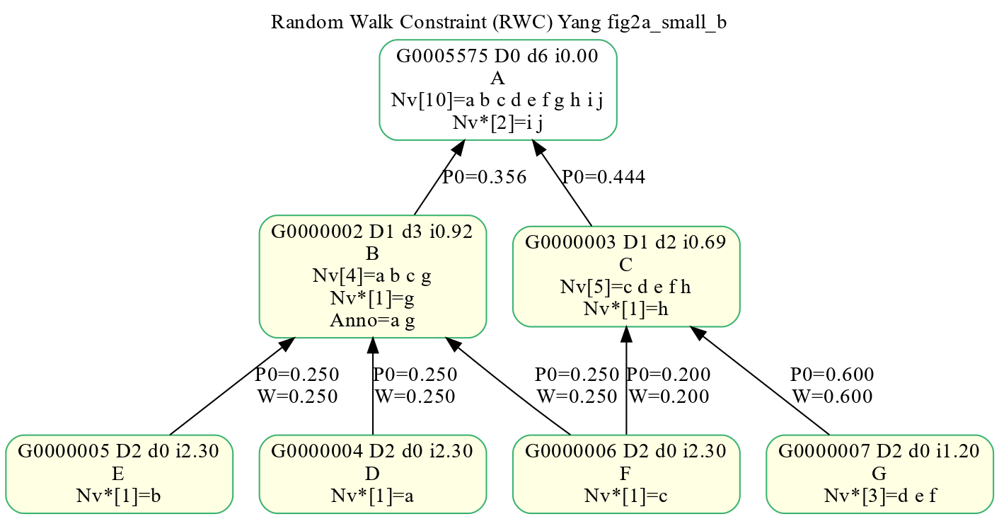

# Yang random walk contribution (RWC) tests
[**Improving GO semantic similarity measures by exploring the ontology beneath the terms and modelling uncertainty**](https://pubmed.ncbi.nlm.nih.gov/22522134)    
Yang, Haixuan et al. Bioinformatics (2012)    

Yang's innovative addition to similarity calculation between two GO terms is to
take into account the descendants of the two GO terms,
leading to greatly imporved similarity measures.

## GO DAGs used to test implementation of Yang RWC

### Original Yang's Fig 2

#### Yang's Fig 2a GO DAG in GOATOOLS
Note that we swapped node F and G    

#### Fig2a modified: 1

#### Fig2a modified: 2

#### Fig2a modified: 3

#### Simplify: All GO terms have one parent

### Original Yang's Fig 1

#### Yang Fig 1a in GOATOOLS

#### Yang Fig 1b in GOATOOLS

